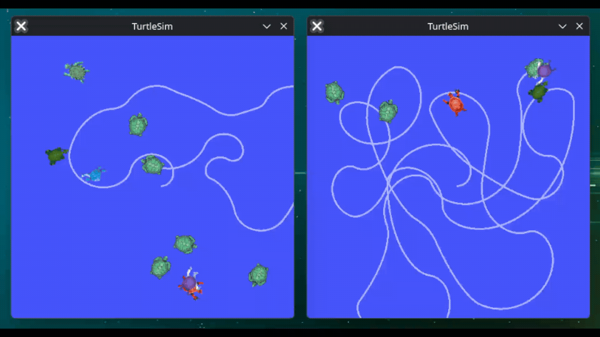

# ROS2 Turtle Controller — Multi-Agent Autonomous Simulation

A modular **ROS2-based autonomous control system** demonstrating multi-agent behavior, service-based communication, and proportional navigation using both **Python** and **C++** implementations.

The system simulates autonomous agents in the `turtlesim` environment that dynamically spawn, track, and intercept targets using configurable control parameters.

This project is designed as a **learning, demonstration, and portfolio system** showcasing practical ROS2 architecture, distributed node communication, and real-time control logic.

---

## Demo

### Multi-Agent Simulation

Place your recorded demo here after capturing it:

```
media/multi_agent_demo.gif
```

Example:

```
ros2_turtle_controller/
├── media/
│   └── multi_agent_demo.gif
```

Then reference it in Markdown:

```markdown

```

---

## Project Features

* ROS2 Humble architecture
* Python and C++ node implementations
* Autonomous agent navigation
* Proportional control motion logic
* Dynamic entity spawning and removal
* Multi-agent simulation support
* Parameter-driven behavior tuning
* Service-based system coordination
* Topic-based state synchronization
* Namespaced multi-instance deployment
* Docker-based ROS2 development environment

---

## System Architecture

The system follows a distributed ROS2 node architecture.

```
+----------------------+
|  Turtle Controller   |
|  (Python / C++)      |
+----------+-----------+
           |
           | services
           v
+----------------------+
|   Turtle Spawner     |
|   (Python / C++)     |
+----------+-----------+
           |
           v
+----------------------+
|      turtlesim       |
+----------------------+
```

---

## Node Overview

### turtle_controller

Responsible for autonomous navigation and decision-making.

Responsibilities:

* Track all active turtles
* Identify the closest target
* Navigate using proportional control
* Detect interception events
* Request target removal
* Spawn replacement targets
* Maintain system state

Publishes:

```
turtle1/cmd_vel
turtle1_pose
turtles_array
```

Subscribes:

```
turtle1/pose
alive_turtles
turtles_array
```

Uses services:

```
trigger_spawn
trigger_myspawn
trigger_catch
trigger_kill
```

---

### turtle_spawner

Acts as a middleware service node that interfaces with `turtlesim`.

Responsibilities:

* Spawn new turtles
* Remove turtles
* Publish active turtle information
* Forward service requests
* Maintain system coordination

Publishes:

```
alive_turtles
```

Provides services:

```
trigger_spawn
trigger_kill
trigger_catch
trigger_myspawn
```

Calls services:

```
/spawn
/kill
```

---

## Controller Logic

The controller uses **proportional control** to guide the primary agent toward the nearest target.

### Motion Model

Linear velocity:

```
v = Kp * distance
```

Angular velocity:

```
ω = Ka * steering_angle
```

Where:

* `Kp` is proportional gain
* `Ka` is angular gain
* `distance` is the distance to target
* `steering_angle` is the heading error

---

### Behavior Loop

The system operates in a continuous control cycle:

```
Spawn turtle
↓
Track closest turtle
↓
Navigate toward target
↓
Detect interception
↓
Remove turtle
↓
Spawn replacement
↓
Repeat
```

---

## Multi-Agent Simulation

The system supports multiple independent simulations running simultaneously using ROS2 namespaces.

Example:

```
game1
game2
```

Each simulation contains:

```
turtlesim
turtle_spawner
turtle_controller
```

This demonstrates:

* scalable architecture
* namespace isolation
* concurrent agent systems
* distributed coordination

---

## Launch Files

### Single-Agent Launch

```
turtle_controller_cpp.launch.xml
turtle_controller_py.launch.xml
```

This launch file starts:

```
turtlesim
turtle_spawner
turtle_controller
```

---

### Multi-Agent Launch

```
turtle_controller_multi_cpp.launch.xml
turtle_controller_multi_py.launch.xml
```

This launch file starts multiple isolated simulations using namespaces.

Example:

```
game1/
game2/
```

Each simulation runs independently.

---

## Parameters

The controller behavior is configurable using ROS2 parameters.

Example configuration file:

```
config/turtle_controller.yaml
```

---

### Parameter Reference

max_alive_turtles

Maximum number of turtles allowed simultaneously.

Example:

```
9
```

---

kill_distance_threshold

Distance at which a target is considered intercepted.

Example:

```
0.6
```

---

linear_vel

Base forward velocity.

Example:

```
2.0
```

---

radius

Initial spiral radius.

Used when no targets exist.

Example:

```
0.5
```

---

angle_decrement

Controls spiral expansion behavior.

Example:

```
0.02
```

---

p_gain

Proportional gain for forward motion.

Example:

```
1.5
```

---

angular_gain

Proportional gain for turning.

Example:

```
2.0
```

---

## Topics

```
turtle1/cmd_vel
turtle1_pose
alive_turtles
turtles_array
```

---

## Services

```
trigger_spawn
trigger_myspawn
trigger_kill
trigger_catch
```

---

## Custom Interfaces

Defined in:

```
my_robot_interfaces
```

Messages:

```
Turtle.msg
TurtleArray.msg
```

Services:

```
SpawnTurtle.srv
CatchTurtle.srv
```

These interfaces allow structured communication between nodes.

---

## Installation

### Requirements

* ROS2 Humble
* Docker
* Fedora 44
* Python 3
* C++17
* colcon

---

### Build Workspace

```
colcon build
```

---

### Source Environment

```
source install/setup.bash
```

---

## Running the System

### Single Simulation

C++ version:

```
ros2 launch my_robot_bringup turtle_controller_cpp.launch.xml
```

Python version:

```
ros2 launch my_robot_bringup turtle_controller_py.launch.xml
```

---

### Multi-Agent Simulation

C++ version:

```
ros2 launch my_robot_bringup turtle_controller_multi_cpp.launch.xml
```

Python version:

```
ros2 launch my_robot_bringup turtle_controller_multi_py.launch.xml
```

---

## Docker Environment

The system is developed using a containerized ROS2 environment.

Platform:

```
ROS2 Humble
Fedora 44
Docker
```

Benefits:

* reproducible builds
* consistent dependencies
* portable development
* isolated runtime

---

## Folder Structure

```
ros2-turtle-controller/

my_cpp_turtle/
my_py_turtle/
my_robot_bringup/
my_robot_controller/
my_robot_interfaces/

config/
launch/
media/

README.md
```

---

## Engineering Concepts Demonstrated

ROS2 Node Architecture
Publisher–Subscriber Communication
Service-Oriented Design
Asynchronous Service Calls
Parameterized Control Systems
Proportional Control
Autonomous Navigation
State Synchronization
Multi-Agent Simulation
Namespace Isolation
Distributed Robotics Systems
Docker-Based Development

---

## Future Improvements

Potential extensions:

* obstacle avoidance
* path planning
* PID control
* SLAM integration
* Gazebo simulation
* real robot deployment
* behavior trees
* swarm coordination

---

## Acknowledgment

The project concept is inspired by the final project of the Udemy course:

by **Edouard Renard**

https://www.udemy.com/user/edouard-renard/

This implementation significantly extends the original learning material with:

* multi-agent simulation
* parameterized control logic
* Python and C++ implementations
* service-based architecture
* modular ROS2 design

The course is highly recommended for learners building a strong foundation in ROS2.

---

## Author

Payman

Robotics and ROS2 Developer
Focus areas:

* Robotics software
* Autonomous systems
* ROS2 architecture
* Control systems
* Distributed robotics
